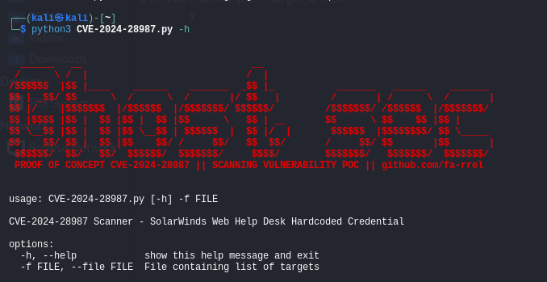

### Description :
The SolarWinds Web Help Desk (WHD) software is affected by a hardcoded credential vulnerability, allowing remote unauthenticated user to access internal functionality and modify data.

### Potential impact :
Exploitation of CVE-2024-28987 could allow an attacker to bypass security policies implemented in SolarWinds Web Help Desk, which could result in unauthorized access to sensitive data, modification of configurations, or other malicious actions that could compromise the integrity of the system. Given the frequent use of Web Help Desk in critical environments, such as businesses and administrations, this vulnerability presents a significant risk.

### Fixes :
The company released a patch in Web Help Desk version 12.8.3 HF2, which addresses this vulnerability. Users are strongly advised to update their software to this version or later to protect against this flaw.

### Workaround :
No effective workarounds have been documented for this vulnerability. Applying the patch is therefore essential to guarantee the security of the systems.

### Usage :
```bash
git clone https://github.com/fa-rrel/CVE-2024-28987-POC.git && cd CVE-2024-28987-POC
```
### Command :

```bash
python3 CVE-2024-28987.py -f {targeturls.txt}
```
### Query :
- FOFA Query : "Web Help Desk"
- Shodan Query : http.favicon.hash:1895809524
